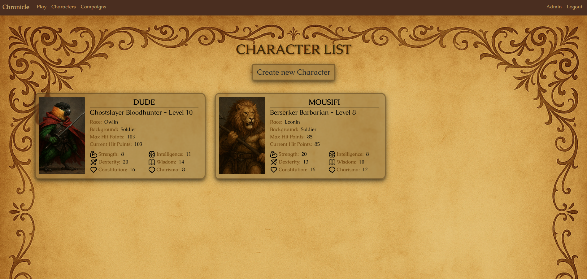

# Chronicle - A DnD Web Application



A Flask + React application for managing DnD characters, sheets, and gameplay pages.

## Tech Stack

- Backend: Flask (Python), pyodbc (SQL Server)
- Frontend: HTML, CSS, React 19 + Vite 7
- Templating: Jinja2 with Bootstrap 5

## Project Structure

```
app.py                    # Flask server and API routes
backend/auth/             # Auth helpers (password hashing, register error parsing)
src/                      # React source (components, pages, entries)
static/                   # Compiled assets (Vite build output) + CSS/images/js
templates/                # Jinja templates (Flask-rendered pages)
vite.config.mjs           # Vite config (dev server + build targets)
package.json              # Frontend scripts and deps
```

## Prerequisites

- Python 3.10+
- Node.js 18+
- SQL Server (local or remote) and the ODBC Driver 17 for SQL Server installed
- Windows PowerShell (or any POSIX shell)

## Environment Configuration

Create a `config.env` in the project root (loaded by `app.py`) with at least:

```
ENV=development
SECRET_KEY=change-me
SERVER=YOUR_SQL_SERVER_HOST\\INSTANCE_OR_HOST
DATABASE=YOUR_DATABASE_NAME
```

Notes:

- `app.py` builds a trusted (Windows) connection string using ODBC Driver 17.
- For SQL authentication, adapt `app.py` to include UID/PWD or enable trusted connection.

## Backend Setup (Flask)

1. Create and activate a virtual environment

```bash
python -m venv .venv
# PowerShell
. .venv/Scripts/Activate.ps1
# bash/zsh
source .venv/bin/activate
```

2. Install Python packages

```bash
pip install flask python-dotenv pyodbc bcrypt werkzeug
```

3. Run the server

```bash
python app.py
```

- Server runs at `http://0.0.0.0:5000` with `debug=True`.

## Frontend Setup (Vite + React)

1. Install dependencies

```bash
npm install
```

2. Development

```bash
npm run dev
```

- Vite dev server runs at `http://localhost:5173`.
- API requests to `/api/*` are proxied to the Flask server. Update the proxy target in `vite.config.mjs` if your backend host differs (current target: `http://192.168.1.202:5000`).

3. Build for production (outputs to `static/js` for Flask)

```bash
npm run build
```

4. Preview the built site

```bash
npm run preview
```

## Key Pages (Flask templates)

- `/` → `templates/index.html`
- `/play` → `templates/play.html`
- `/characterlist` (auth required) → `templates/characterListPage.html`
- `/charactersheet/<id>` → `templates/characterSheetPage.html`
- `/charactercreation` (auth required) → `templates/characterCreationPage.html`
- `/campaigns` → `templates/campaigns.html`
- `/profile` → `templates/profile.html`

## API (JSON)

- `GET /api/list-of-characters/`
- `POST /api/create-character/` (in progress)
- `GET /api/character/<char_id>`
- `POST /api/update-character/<char_id>`
- `POST /api/add-weapon/<char_id>` / `POST /api/delete-weapon/`
- `POST /api/add-feature/<char_id>` / `POST /api/delete-feature/`
- `GET /api/profile/`

Auth routes:

- `POST /register`
- `POST /login`
- `GET /logout`

## Assets & Uploads

- Static images: `static/images`
- Uploaded character images: `static/images/characterImages/`

## Troubleshooting

- ODBC/pyodbc errors: verify ODBC Driver 17 is installed and connection variables are correct.
- 401/403 from APIs: certain routes require a session; login first.
- Dev proxy fails: ensure Flask is running at the configured host/port or adjust the proxy target.
